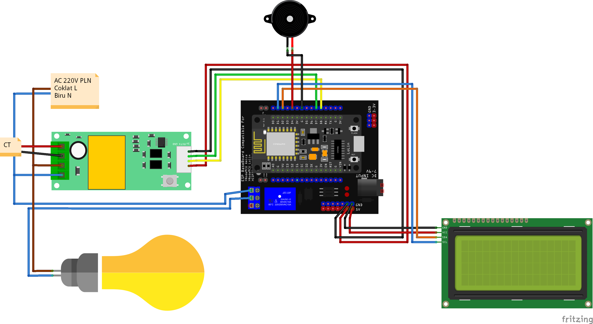

# ESP8266 WiFi-Based KWH Monitoring System

- This project implements a KWH (Kilowatt-hour) monitoring system using the ESP8266 module, a PZEM004T v3.0 sensor for energy measurement, and an I2C LCD display for real-time feedback. Data from the PZEM004T is sent to a server via HTTP POST, and the server's response controls a relay for a connected device.

## Components Used

- NodeMCU ESP8266 Lolin V.3 and Shield KelasRobot.com : WiFi module to connect the system to the internet.
- PZEM004T v3.0: Power, energy, voltage, and current sensor.
- Relay Module: Used to control electrical devices based on energy usage.
- LCD Display with I2C (20x4): Displays the real-time data for voltage, current, power, energy, frequency, and power factor.
- Modul Buzzer: Provides an alert when energy consumption reaches a set limit.
- WiFi Network: Required for communication with the API.

To purchase components, you can purchase them via the following link at [Link](https://www.tokopedia.com/kelasrobot/paket-belajar-proyek-kwh-meter-listrik-iot-berbasis-web-php-mysql-source-code)

## Circuit Schematic



## Features

- Energy Monitoring: Measures and displays voltage, current, power, energy, frequency, and power factor.
- Data Transmission: Sends the energy data to a server via HTTP POST.
- Remote Control: Receives commands from the server to control a relay (on/off).
- Energy Limit Alert: Activates a buzzer when the remaining energy is depleted, and the relay is turned off.

- Pin Connections

  - PZEM004T v3.0:
    - RX → D3
    - TX → D4
  - Relay:
    - Control Pin → D5
  - Buzzer:
    - Control Pin → D6
  - LCD I2C:
    - SDA → D2
    - SCL → D1

## Setup Instructions

1. Install Arduino IDE

- Download and install the Arduino IDE to upload the code to the ESP8266.

2. Install ESP8266 Board
   - Open Arduino IDE.
   - Go to File > Preferences.
   - In the "Additional Board Manager URLs" field, add:

```bash
http://arduino.esp8266.com/stable/package_esp8266com_index.json
```

- Go to Tools > Board > Board Manager.
- Search for ESP8266 and install the latest version of ESP8266 by ESP Community.

3. Install Required Libraries

- Ensure the following libraries are installed in your Arduino IDE:

  - ESP8266WiFi.h: For connecting the ESP8266 to WiFi.
  - ESP8266HTTPClient.h: To handle HTTP POST and GET requests.
  - PZEM004Tv30.h: For interfacing with the PZEM004T energy meter.
  - LiquidCrystal_I2C.h: To control the I2C LCD display.
  - ArduinoJson.h: For handling JSON data from the server.

4. Hardware Setup

   - Connect the PZEM004T to the ESP8266's D3 (RX) and D4 (TX).
   - Connect the LCD I2C SDA to D2 and SCL to D1.
   - Connect the relay module to D5 to control a connected device.
   - Connect the buzzer to D6 for sound alerts.

5. Code Upload

Open the provided Arduino code and adjust the following variables to match your setup:

    - SSID and Password for your WiFi network.
    - The API URLs for sending data and controlling the relay.

```cpp
const char* ssid = "Your_SSID";
const char* password = "Your_PASSWORD";
String url = "http://your-server-address/kwhmeter/api/create.php";
String url2 = "http://your-server-address/kwhmeter/api/update.php";
```

After adjusting the code, upload it to your ESP8266.

<hr/>

## Code Overview

### Main Components:

- WiFi Connection: The ESP8266 connects to your WiFi network using the SSID and password provided.
- Energy Data Collection: The PZEM004T sensor measures voltage, current, power, energy, frequency, and power factor.
- Data Display: The LCD displays the current values for voltage, current, power, energy, frequency, and power factor.
- Server Communication: The data is sent to a server using an HTTP POST request. The server's response determines if the relay should turn on or off.
- Buzzer Alert: When energy consumption reaches a limit (sisa KWH <= 0), the buzzer is activated, and the relay is turned off.

### Relay Control Logic

The relay can be controlled based on the server's response:

- "ON": The relay allows power to flow to the connected device.
- "OFF": The relay disconnects the power to save energy or when the energy limit is exceeded.

### Energy Limit Handling

If the remaining energy (sisa KWH) falls to zero or below:

- The relay is turned off to disconnect the power.
- The buzzer sounds an alert.

<hr/>

## Usage

Once the system is running:

- It will continuously monitor the energy parameters.
- The data will be sent to your server for logging and control purposes.
- The LCD will display the current status in real-time.
- The relay will respond to server commands to control the connected device.

<hr/>

## Example Output

```yaml
V: 220.50 C: 0.35
P: 75.50 E: 0.020
F: 50.00 Pf: 0.95
KWH Tersedia: 0.98
```

<hr/>

## Troubleshooting

- No WiFi Connection: Ensure the SSID and password in the code match your network credentials.
- No Sensor Readings: Check that the PZEM004T is correctly wired to the ESP8266.
- LCD Display Issues: Ensure the correct I2C address is being used (0x3F or 0x27).
